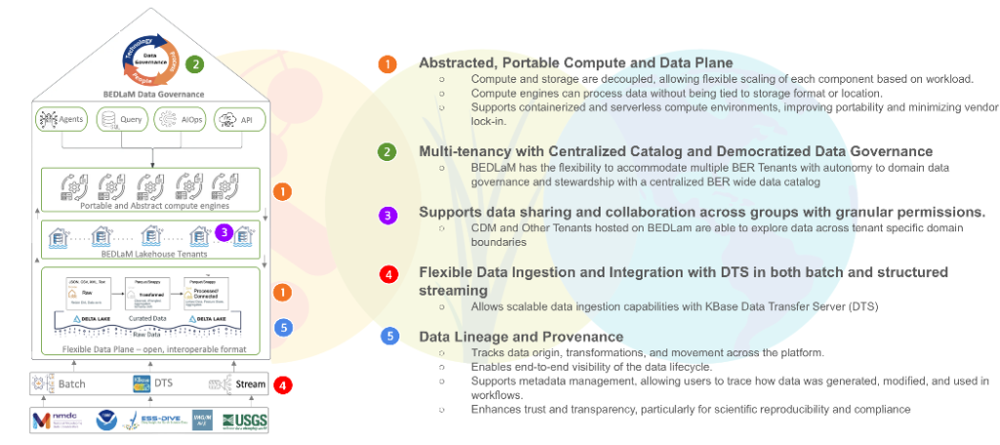

# KBase Data Lakehouse Architecture

**A Multi-Tenant, AI-Native Data Lakehouse Platform for BER-Wide Data Integration**

The KBase Data Lakehouse (K-BERDL) provides a unified technical foundation for data integration, large-scale analytics, and multi-program collaboration across the DOE Biological and Environmental Research (BER) ecosystem. Its architecture is designed to support diverse scientific workflows—from genomics and multi-omics to environmental observations and machine-learning–assisted discovery—by combining scalable storage, portable compute, fine-grained governance, and rich metadata capabilities.

The following sections describe the core architectural principles and how they shape the platform’s functionality, extensibility, and scientific value.

## 1. Abstracted, Portable Compute and Data Plane

At the heart of the architecture is a decoupled compute and storage model, ensuring that the platform remains flexible, scalable, and portable across infrastructures.

### Decoupled Architecture

The data plane (storage) and compute plane (Spark, Ray, containerized runtimes) operate independently:

*   **Compute clusters can scale horizontally** based on workload demand.
*   **Storage grows independently** of compute, enabling cost-efficient expansion.
*   **Multiple compute backends** (JupyterHub, Spark, task services, agentic workers) access the same underlying datasets.

This design removes resource bottlenecks and allows the platform to adapt to diverse scientific pipelines.

### Storage-Agnostic Compute

Compute services do not depend on a specific storage system:

*   **Delta Lake on MinIO** serves as the default transactional storage layer.
*   The system can read/write to **external object stores (S3, Swift)**, shared filesystems, or federated storage systems through standard connectors.
*   Data is accessed via **open formats (Parquet, Delta, JSON, CSV)**, ensuring interoperability with HPC, cloud, and containerized environments.

This abstraction minimizes vendor lock-in and maximizes computational portability.

### Portable Compute Environments

The platform is intentionally designed for hybrid and portable operation:

*   **Containerized compute** (Docker, Kubernetes, Podman)
*   **Spark clusters** running on local Kubernetes, cloud clusters, or HPC environments
*   **Serverless or ephemeral compute** environments triggered by events or tasks
*   **AI/ML workloads** deployed through event-driven task services or agent frameworks

This portability supports future BER-wide platform deployments across labs and cloud-augmented environments.

## 2. Multi-Tenancy with Centralized Catalog and Democratized Data Governance

The KBase Data Lakehouse must support multiple BER programs, each with unique data types, governance needs, and scientific workflows. The architecture incorporates a multi-tenant model rooted in autonomy, security, and discoverability.

### Flexible Multi-Tenancy

Each BER program—such as KBase, JGI, NMDC, EMSL, and ESS-DIVE—can operate as an independent tenant with:

*   Dedicated namespaces and schemas
*   Independent ingestion pipelines
*   Program-specific metadata models
*   Custom access control policies

This allows each program to maintain stewardship over its data while benefiting from a unified platform.

### Tenant Autonomy and Ownership

Tenants control:

*   Data organization and schema definitions
*   Access policies for their storage layer
*   Approved datasets for cross-tenant sharing
*   Metadata enrichment and classification

Governance is decentralized at the tenant level, while platform-level services enforce standardized security and lineage policies.

### Unified BER-Wide Data Catalog

Although tenants are isolated, the platform provides a single federated metadata catalog powered by Apache Atlas (or an equivalent metadata service):

*   Scientists can search, browse, and discover datasets across all tenants.
*   Policies determine what metadata—and what data—is visible to whom.
*   Cross-program research teams can identify relevant datasets without compromising data security.

This delivers a shared knowledge layer across the entire BER community.

## 3. Supports Data Sharing and Collaboration

The Lakehouse is built to encourage collaboration and scientific reuse while respecting data ownership and policy boundaries.

### Cross-Domain Data Exploration

Scientists, analysts, and automated workflows can explore datasets across tenant boundaries (subject to permissions). This enables:

*   Integrative multi-omics workflows
*   Cross-program comparisons (e.g., JGI assemblies + NMDC metadata)
*   Joint modeling projects across labs
*   Large-scale ecosystem and environmental analyses

Data need not be physically moved—access is managed through governance policies.

### Fine-Grained Access Controls

The architecture supports highly granular access patterns:

*   Table-level, column-level, row-level, and tag-based restrictions
*   Roles for tenant stewards, analysts, contributors, and viewers
*   Conditional access (e.g., allow viewing of metadata but not raw sequences)

This ensures that sensitive or proprietary data is protected while maximizing scientific collaboration.

## 4. Flexible Data Ingestion and Integration

Scientific data arrives in many forms and at different velocities. The platform provides flexible ingestion mechanisms to accommodate all.

### Hybrid Ingestion Modes

The Lakehouse supports:

*   **Batch ingestion** for large files, facility outputs, historical datasets
*   **Structured streaming** for incremental updates, instrument feeds, metadata events
*   **Event-driven ingestion** triggered by the KBase Data Transfer Server (DTS), task services, or agents
*   **Schema-aware ingestion** for harmonized scientific domains

This flexibility enables scalable ingest pipelines for genomics, multi-omics, environmental observations, and knowledge graphs.

### Scalable Data Transfer via KBase DTS

The Data Transfer Server (DTS) provides a secure and scalable mechanism for moving large datasets into the platform:

*   Parallel multi-stream upload
*   Transfer resume & integrity checks
*   Integration with user-level authentication
*   Automated pipeline triggering upon arrival

DTS ensures that data ingestion remains efficient even for terabyte-scale workloads.

### Integration with External Systems

The Lakehouse can connect to:

*   DOE facility data streams
*   KBase Apps and Narratives
*   JGI and NMDC APIs
*   HPC data outputs
*   Cloud buckets
*   AI-driven task services

This establishes the Data Lakehouse as a central integration point across BER.

## 5. Data Lineage and Provenance

Scientific workflows demand transparency, reproducibility, and auditability. The architecture embeds lineage and provenance tracking as first-class capabilities.

### End-to-End Lifecycle Tracking

The platform automatically tracks:

*   Data origin (source, project, method)
*   Ingestion pipelines and parameter settings
*   Transformations (Silver/Gold layer refinements)
*   Downstream analyses (Spark jobs, AI tasks, workflows)
*   User actions and permissions

This enables users to reconstruct full analytical histories.

### Visibility & Metadata Management

All datasets, tables, workflows, and transformations are annotated with:

*   **Technical metadata** (schemas, file structures, timestamps)
*   **Semantic metadata** (ontologies, biological entities)
*   **Governance metadata** (ownership, policies)
*   **Lineage graphs** (input → transformation → output)

These metadata enrichments allow users and automated agents to reason about data relationships.

### Trust, Reproducibility, and Scientific Integrity

The Lakehouse architecture ensures:

*   Reproducible computational paths
*   Transparent data transformations
*   Stable references to dataset versions via Delta Lake’s time travel
*   Compliance with FAIR data principles

This strengthens scientific rigor and reduces uncertainty in downstream analyses and modeling efforts.

## Summary

The KBase Data Lakehouse architecture is built to support the future of BER-wide, cross-program data integration. Its core principles—compute portability, tenant autonomy, collaborative access, flexible ingestion, and robust lineage—combine to deliver a scalable and trustworthy platform for data-intensive scientific discovery.

It is the foundation upon which next-generation AI-assisted data ecosystems, automated reasoners, and federated scientific knowledge graphs will be built.
